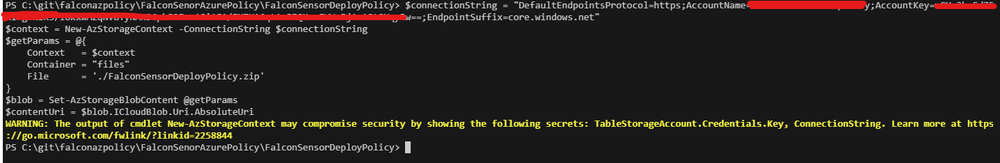
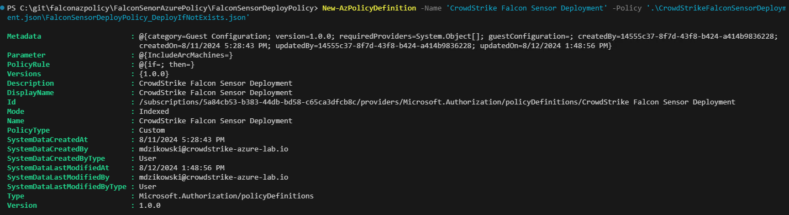
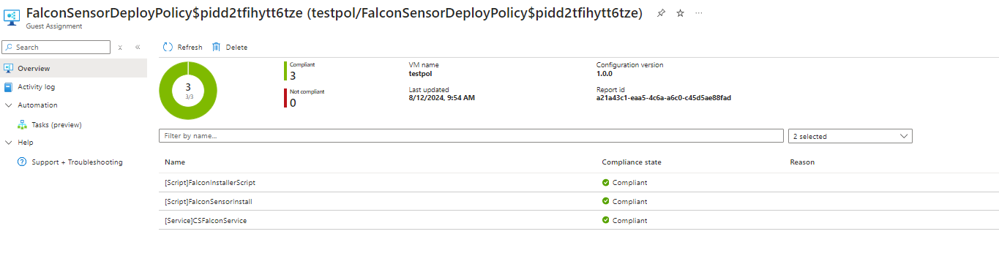

# FalconSensorAzurePolicy  

Audit or deploy the CrowdStrike Falcon Sensor to windows endpoints using Azure Policy, PowerShell DSC and Azure Machine Configuration.

> [!IMPORTANT]
> **Deployment considerations**

* Create the required APIs by following the instructions here: [Falcon Powershell Installation Scripts](https://github.com/CrowdStrike/falcon-scripts/tree/main/powershell/install)

* The machine configuration extension is required for this Azure Policy. To deploy the latest version of the Machine Configuration extension at scale including identity requirements, follow the steps in Create a policy assignment to identify noncompliant resources. Create the following assignment with Azure Policy: [Deploy prerequisites to enable Guest Configuration policies on virtual machines](https://github.com/Azure/azure-policy/blob/master/built-in-policies/policySetDefinitions/Guest%20Configuration/Prerequisites.json)

## Configuration

1.Install the machine configuration DSC resource module from PowerShell Gallery. Reference - [Setup up local machine for authoring](https://learn.microsoft.com/en-us/azure/governance/machine-configuration/how-to-set-up-authoring-environment)

```powershell
Install-Module -Name GuestConfiguration
```

> [!NOTE]
> Please use PowerShell 5.1 for the next step

2.**Using PowerShell 5.1**, author the DSC coniguration. Reference - [Author a configuration](https://learn.microsoft.com/en-us/azure/governance/machine-configuration/how-to-create-package#author-a-configuration)

When running the steps below you will be prompted for your CustomerId (FalconClientId) and your CustomerAuthentication (FalconClientSecret).

```powershell
. .\FalconSensorDeployPolicy.ps1
cd .\FalconSensorDeployPolicy\
Rename-Item -Path .\localhost.mof -NewName FalconSensorDeployPolicy.mof -PassThru
```

> [!NOTE]
> Please use PowerShell 7.3+ for the next step

3.**Using PowerShell 7.3** - create a package that will audit and apply the configuration (Set).

Example

```powershell
# Create a package that will audit and apply the configuration (Set).
$params = @{
    Name          = 'FalconSensorDeployPolicy'
    Configuration = './FalconSensorDeployPolicy.mof'
    Type          = 'AuditAndSet'
    Force         = $true
}
New-GuestConfigurationPackage @params
```

4.This step requires a storage account. If you do not have a storage account and container please create those items before proceeding. Use Set-BlobContext to store the context of your storage account. Please note the connection string of the storage account.  

Reference - [Publish a configuration package](https://learn.microsoft.com/en-us/azure/governance/machine-configuration/how-to-publish-package#publish-a-configuration-package)

Reference - [Configue Azure Storage connection settings](https://learn.microsoft.com/en-us/azure/storage/common/storage-configure-connection-string)

Using Set-BlobContext.ps1

> [!NOTE]
> In the following deployment examples, replace < placeholder > values with specific values for your configuration.

```powershell
$connectionString = <_ YOUR CONNECTION STRING _>
$context = New-AzStorageContext -ConnectionString $connectionString
$getParams = @{
    Context   = $context
    Container = <_ YOUR CONTAINER _>
    File      = './FalconSensorDeployPolicy.zip'
}
$blob = Set-AzStorageBlobContent @getParams
$contentUri = $blob.ICloudBlob.Uri.AbsoluteUri
```

Example result

Next, set the storage context with a SAS token using Set-StorageContext.ps1

```powershell
$startTime = Get-Date
$endTime   = $startTime.AddYears(3)

$tokenParams = @{
    StartTime  = $startTime
    ExpiryTime = $endTime
    Container  = 'files'
    Blob       = 'FalconSensorDeployPolicy.zip'
    Permission = 'r'
    Context    = $context
    FullUri    = $true
}
$contentUri = New-AzStorageBlobSASToken @tokenParams
```

5.To test the package run the following:

```powershell
# Get the current compliance results for the local machine
Get-GuestConfigurationPackageComplianceStatus -Path ./FalconSensorDeployPolicy.zip

# Test applying the configuration to local machine
Start-GuestConfigurationPackageRemediation -Path ./FalconSensorDeployPolicy.zip
```

6.To create the policy definition run the following lines of code

```powershell
$PolicyConfig      = @{
    PolicyId      = New-Guid
    ContentUri    = $contentUri
    DisplayName   = 'CrowdStrike Falcon Sensor Deployment'
    Description   = 'CrowdStrike Falcon Sensor Deployment'
    Path          = './CrowdStrikeFalconSensorDeployment.json'
    Platform      = 'Windows'
    PolicyVersion = '1.0.0'
    Mode          = 'ApplyAndAutoCorrect'
  }
  New-GuestConfigurationPolicy @PolicyConfig -Verbose
```

7.To import the policy into your Azure environment

```powershell
New-AzPolicyDefinition -Name 'CrowdStrike Falcon Sensor Deployment' -Policy '.\FalconSensorDeployPolicy_DeployIfNotExists.json'
```

Example


8.After deploying the policy the expected result is as follows:


